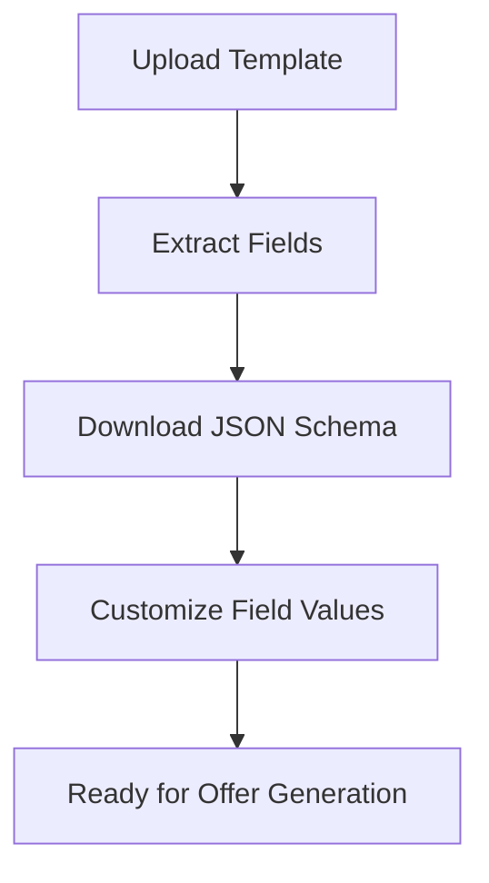

# SimplifyHR Send_Offer API - UI Developer Integration Guide

## 🎯 Overview

This guide provides comprehensive documentation for UI developers to integrate with the SimplifyHR Send_Offer API. The API provides a complete workflow for extracting template fields and generating professional offer letters.

## 🌐 Base Configuration

```javascript
const API_BASE_URL = 'http://localhost:8000';
const API_VERSION = '/api/v1';
```

## 📋 Table of Contents

1. [Quick Start](#quick-start)
2. [Authentication](#authentication)
3. [API Endpoints](#api-endpoints)
4. [Integration Workflows](#integration-workflows)
5. [Error Handling](#error-handling)
6. [File Management](#file-management)
7. [UI Components Examples](#ui-components-examples)
8. [Sample Integration Code](#sample-integration-code)

---

## 🚀 Quick Start

### Basic Setup

```javascript
// API Configuration
const config = {
  baseURL: 'http://localhost:8000',
  timeout: 30000,
  headers: {
    'Content-Type': 'multipart/form-data'
  }
};

// Basic API client
const apiClient = axios.create(config);
```

### Health Check
Always verify the API is running before making requests:

```javascript
async function checkAPIHealth() {
  try {
    const response = await fetch(`${API_BASE_URL}/health`);
    const health = await response.json();
    console.log('API Status:', health.status); // "healthy"
    return health.status === 'healthy';
  } catch (error) {
    console.error('API Health Check Failed:', error);
    return false;
  }
}
```

---

## 🔐 Authentication

Currently, the API does not require authentication. All endpoints are publicly accessible for development purposes.

---

## 🛠 API Endpoints

### 1. Root Endpoint - API Information

**GET** `/`

Returns basic API information and available endpoints.

```javascript
async function getAPIInfo() {
  const response = await fetch(`${API_BASE_URL}/`);
  return await response.json();
}

// Response:
{
  "message": "SimplifyHR Offer Letter API v3.0.0",
  "version": "3.0.0",
  "status": "running",
  "endpoints": {
    "health": "/health",
    "generate_offer": "/api/v1/generate-offer",
    "extract_template_fields": "/api/v1/extract-template-fields",
    "download": "/api/v1/download/{filename}",
    "send_bulk_emails": "/api/v1/send-bulk-emails"
  }
}
```

### 2. Health Check

**GET** `/health`

Check system health and resource usage.

```javascript
async function getSystemHealth() {
  const response = await fetch(`${API_BASE_URL}/health`);
  return await response.json();
}

// Response:
{
  "status": "healthy",
  "timestamp": "2025-08-21T14:23:45.123456",
  "uptime": "2:34:12",
  "system": {
    "cpu_usage": 15.2,
    "memory_usage": 45.8,
    "disk_usage": 62.1
  }
}
```

### 3. Extract Template Fields ⭐ NEW

**POST** `/api/v1/extract-template-fields`

Extract placeholders from a DOCX template and generate a JSON schema.

#### Parameters:
- `template_file` (file): DOCX template file
- `include_sample_data` (boolean): Include sample data in JSON schema

#### UI Implementation:

```javascript
async function extractTemplateFields(templateFile, includeSampleData = true) {
  const formData = new FormData();
  formData.append('template_file', templateFile);
  formData.append('include_sample_data', includeSampleData);

  const response = await fetch(`${API_BASE_URL}/api/v1/extract-template-fields`, {
    method: 'POST',
    body: formData
  });

  if (!response.ok) {
    throw new Error(`HTTP error! status: ${response.status}`);
  }

  return await response.json();
}

// Usage in React component:
const handleTemplateUpload = async (file) => {
  try {
    setLoading(true);
    const result = await extractTemplateFields(file, true);
    
    // Update UI with extracted fields
    setTemplateInfo(result.template_info);
    setJsonDownloadUrl(result.json_file.download_url);
    setPlaceholders(result.template_info.placeholders);
    
  } catch (error) {
    setError('Failed to extract template fields: ' + error.message);
  } finally {
    setLoading(false);
  }
};
```

#### Response Format:

```javascript
{
  "success": true,
  "request_id": "d8523af5-a6c4-46b9-aab5-ab65a6db832c",
  "message": "Template fields extracted successfully",
  "template_info": {
    "filename": "offer_template.docx",
    "placeholders_found": 35,
    "placeholders": [
      "candidate_name", "position", "salary", "start_date", 
      "company_name", "department", "reporting_manager", "..."
    ],
    "paragraph_count": 64,
    "table_count": 0,
    "section_count": 1
  },
  "json_file": {
    "download_url": "/api/v1/download/template_fields_[id]_[timestamp].json",
    "filename": "template_fields_[id]_[timestamp].json"
  },
  "usage_instructions": {
    "description": "Use the generated JSON file as data input for /api/v1/generate-offer endpoint",
    "example_curl": "curl -X POST ..."
  }
}
```

### 4. Download Generated Files

**GET** `/api/v1/download/{filename}`

Download generated JSON schemas, offer letters, or other files.

```javascript
async function downloadFile(filename, downloadName = null) {
  const response = await fetch(`${API_BASE_URL}/api/v1/download/${filename}`);
  
  if (!response.ok) {
    throw new Error(`Download failed: ${response.status}`);
  }

  const blob = await response.blob();
  
  // Create download link
  const url = window.URL.createObjectURL(blob);
  const a = document.createElement('a');
  a.href = url;
  a.download = downloadName || filename;
  document.body.appendChild(a);
  a.click();
  document.body.removeChild(a);
  window.URL.revokeObjectURL(url);
}

// Download JSON schema
async function downloadJsonSchema(downloadUrl) {
  const filename = downloadUrl.split('/').pop();
  await downloadFile(filename, 'template_fields.json');
}
```

### 5. Generate Offer Letter

**POST** `/api/v1/generate-offer`

Generate offer letters using a template and data file.

#### Parameters:
- `template_file` (file): DOCX template file
- `data_file` (file): JSON file with field values
- `output_format` (string): "docx", "pdf", or "both"

```javascript
async function generateOfferLetter(templateFile, dataFile, outputFormat = 'both') {
  const formData = new FormData();
  formData.append('template_file', templateFile);
  formData.append('data_file', dataFile);
  formData.append('output_format', outputFormat);

  const response = await fetch(`${API_BASE_URL}/api/v1/generate-offer`, {
    method: 'POST',
    body: formData
  });

  if (!response.ok) {
    throw new Error(`HTTP error! status: ${response.status}`);
  }

  return await response.json();
}
```

#### Response Format:

```javascript
{
  "success": true,
  "request_id": "e32fa71f-c562-4806-ad8b-88e34599098c",
  "message": "Offer letter generated successfully",
  "files": {
    "docx": {
      "filename": "offer_letter_[id]_[timestamp].docx",
      "download_url": "/api/v1/download/offer_letter_[id]_[timestamp].docx",
      "size": "45.2 KB"
    },
    "pdf": {
      "filename": "offer_letter_[id]_[timestamp].pdf", 
      "download_url": "/api/v1/download/offer_letter_[id]_[timestamp].pdf",
      "size": "123.8 KB"
    }
  },
  "generation_info": {
    "placeholders_replaced": 35,
    "template_filename": "offer_template.docx",
    "data_filename": "candidate_data.json"
  }
}
```

### 6. Send Bulk Emails

**POST** `/api/v1/send-bulk-emails`

Send offer letters via email to multiple candidates.

#### Parameters:
- `email_data` (file): JSON file with email configurations
- `template_file` (file): Email template file
- `smtp_config` (object): Email server configuration

```javascript
async function sendBulkEmails(emailData, templateFile, smtpConfig) {
  const formData = new FormData();
  formData.append('email_data', emailData);
  formData.append('template_file', templateFile);
  formData.append('smtp_config', JSON.stringify(smtpConfig));

  const response = await fetch(`${API_BASE_URL}/api/v1/send-bulk-emails`, {
    method: 'POST',
    body: formData
  });

  return await response.json();
}
```

---

## 🔄 Integration Workflows

### Workflow 1: Template Setup and Field Extraction



#### Implementation:

```javascript
class TemplateManager {
  constructor() {
    this.template = null;
    this.fields = [];
    this.jsonSchema = null;
  }

  async setupTemplate(templateFile) {
    // Step 1: Upload and extract fields
    const extraction = await extractTemplateFields(templateFile, true);
    
    this.template = templateFile;
    this.fields = extraction.template_info.placeholders;
    
    // Step 2: Download JSON schema
    const jsonResponse = await fetch(`${API_BASE_URL}${extraction.json_file.download_url}`);
    this.jsonSchema = await jsonResponse.json();
    
    return {
      fieldsCount: this.fields.length,
      fields: this.fields,
      schema: this.jsonSchema
    };
  }

  getFieldValue(fieldName) {
    return this.jsonSchema[fieldName] || '';
  }

  updateFieldValue(fieldName, value) {
    if (this.jsonSchema) {
      this.jsonSchema[fieldName] = value;
    }
  }

  exportCustomizedData() {
    const blob = new Blob([JSON.stringify(this.jsonSchema, null, 2)], {
      type: 'application/json'
    });
    return new File([blob], 'customized_data.json', {
      type: 'application/json'
    });
  }
}
```

### Workflow 2: Complete Offer Generation Process

```javascript
class OfferLetterGenerator {
  constructor() {
    this.templateManager = new TemplateManager();
  }

  async generateComplete(templateFile, candidateData, outputFormat = 'both') {
    try {
      // Step 1: Setup template and extract fields
      await this.templateManager.setupTemplate(templateFile);
      
      // Step 2: Update with candidate-specific data
      Object.entries(candidateData).forEach(([field, value]) => {
        this.templateManager.updateFieldValue(field, value);
      });
      
      // Step 3: Create data file
      const dataFile = this.templateManager.exportCustomizedData();
      
      // Step 4: Generate offer letter
      const result = await generateOfferLetter(templateFile, dataFile, outputFormat);
      
      return result;
      
    } catch (error) {
      throw new Error(`Offer generation failed: ${error.message}`);
    }
  }
}
```

### Workflow 3: Bulk Processing

```javascript
class BulkOfferProcessor {
  constructor() {
    this.results = [];
  }

  async processBatch(templateFile, candidatesData) {
    const results = [];
    
    for (const candidate of candidatesData) {
      try {
        const generator = new OfferLetterGenerator();
        const result = await generator.generateComplete(
          templateFile, 
          candidate.data, 
          'both'
        );
        
        results.push({
          candidate: candidate.name,
          success: true,
          files: result.files
        });
        
      } catch (error) {
        results.push({
          candidate: candidate.name,
          success: false,
          error: error.message
        });
      }
    }
    
    return results;
  }
}
```

---

## ⚠️ Error Handling

### Common Error Responses

```javascript
// HTTP 400 - Bad Request
{
  "detail": "Template file must be .docx format"
}

// HTTP 422 - Validation Error  
{
  "detail": [
    {
      "loc": ["body", "template_file"],
      "msg": "field required",
      "type": "value_error.missing"
    }
  ]
}

// HTTP 500 - Server Error
{
  "detail": "Internal server error occurred"
}
```

### Error Handling Implementation

```javascript
class APIErrorHandler {
  static handle(error, context = '') {
    if (error.response) {
      // HTTP error response
      const status = error.response.status;
      const data = error.response.data;
      
      switch (status) {
        case 400:
          return `Invalid request: ${data.detail}`;
        case 422:
          const validationErrors = data.detail.map(err => err.msg).join(', ');
          return `Validation errors: ${validationErrors}`;
        case 500:
          return 'Server error occurred. Please try again later.';
        default:
          return `Unexpected error (${status}): ${data.detail}`;
      }
    } else if (error.request) {
      // Network error
      return 'Network error: Unable to connect to server';
    } else {
      // Other error
      return `Error in ${context}: ${error.message}`;
    }
  }
}

// Usage in React component
const handleAPICall = async (apiFunction) => {
  try {
    setLoading(true);
    setError(null);
    const result = await apiFunction();
    return result;
  } catch (error) {
    const errorMessage = APIErrorHandler.handle(error, 'API call');
    setError(errorMessage);
    throw error;
  } finally {
    setLoading(false);
  }
};
```

---

## 📁 File Management

### File Type Validation

```javascript
class FileValidator {
  static validateTemplate(file) {
    const allowedTypes = [
      'application/vnd.openxmlformats-officedocument.wordprocessingml.document'
    ];
    const allowedExtensions = ['.docx'];
    
    const extension = file.name.toLowerCase().slice(file.name.lastIndexOf('.'));
    
    if (!allowedTypes.includes(file.type) && !allowedExtensions.includes(extension)) {
      throw new Error('Only .docx files are allowed for templates');
    }
    
    if (file.size > 10 * 1024 * 1024) { // 10MB limit
      throw new Error('File size must be less than 10MB');
    }
    
    return true;
  }

  static validateJSON(file) {
    const allowedTypes = ['application/json'];
    const allowedExtensions = ['.json'];
    
    const extension = file.name.toLowerCase().slice(file.name.lastIndexOf('.'));
    
    if (!allowedTypes.includes(file.type) && !allowedExtensions.includes(extension)) {
      throw new Error('Only .json files are allowed for data');
    }
    
    return true;
  }
}
```

### File Upload Component

```javascript
const FileUploader = ({ onFileSelect, accept, validator, label }) => {
  const [dragOver, setDragOver] = useState(false);
  const [error, setError] = useState(null);

  const handleFileSelect = (file) => {
    try {
      setError(null);
      if (validator) {
        validator(file);
      }
      onFileSelect(file);
    } catch (err) {
      setError(err.message);
    }
  };

  const handleDrop = (e) => {
    e.preventDefault();
    setDragOver(false);
    const file = e.dataTransfer.files[0];
    if (file) {
      handleFileSelect(file);
    }
  };

  return (
    <div 
      className={`file-uploader ${dragOver ? 'drag-over' : ''}`}
      onDrop={handleDrop}
      onDragOver={(e) => { e.preventDefault(); setDragOver(true); }}
      onDragLeave={() => setDragOver(false)}
    >
      <input
        type="file"
        accept={accept}
        onChange={(e) => handleFileSelect(e.target.files[0])}
        style={{ display: 'none' }}
        id="file-input"
      />
      <label htmlFor="file-input" className="upload-label">
        {label || 'Click to upload or drag & drop'}
      </label>
      {error && <div className="error-message">{error}</div>}
    </div>
  );
};
```

---

## 🎨 UI Components Examples

### 1. Template Field Editor

```jsx
const TemplateFieldEditor = ({ fields, values, onChange }) => {
  const [searchTerm, setSearchTerm] = useState('');
  
  const filteredFields = fields.filter(field =>
    field.toLowerCase().includes(searchTerm.toLowerCase())
  );

  const getFieldLabel = (fieldName) => {
    return fieldName.replace(/_/g, ' ').replace(/\b\w/g, l => l.toUpperCase());
  };

  const getFieldType = (fieldName) => {
    if (fieldName.includes('email')) return 'email';
    if (fieldName.includes('phone')) return 'tel';
    if (fieldName.includes('date')) return 'date';
    if (fieldName.includes('salary') || fieldName.includes('amount')) return 'number';
    return 'text';
  };

  return (
    <div className="template-field-editor">
      <div className="search-bar">
        <input
          type="text"
          placeholder="Search fields..."
          value={searchTerm}
          onChange={(e) => setSearchTerm(e.target.value)}
        />
      </div>
      
      <div className="fields-grid">
        {filteredFields.map(field => (
          <div key={field} className="field-item">
            <label htmlFor={field}>{getFieldLabel(field)}</label>
            <input
              id={field}
              type={getFieldType(field)}
              value={values[field] || ''}
              onChange={(e) => onChange(field, e.target.value)}
              placeholder={`Enter ${getFieldLabel(field).toLowerCase()}`}
            />
          </div>
        ))}
      </div>
    </div>
  );
};
```

### 2. Progress Tracker

```jsx
const OfferGenerationProgress = ({ currentStep, steps, loading }) => {
  return (
    <div className="progress-tracker">
      {steps.map((step, index) => (
        <div 
          key={index}
          className={`step ${index < currentStep ? 'completed' : ''} ${index === currentStep ? 'active' : ''}`}
        >
          <div className="step-indicator">
            {index < currentStep ? '✓' : index + 1}
          </div>
          <div className="step-label">{step.label}</div>
          {index === currentStep && loading && (
            <div className="spinner"></div>
          )}
        </div>
      ))}
    </div>
  );
};

// Usage
const steps = [
  { label: 'Upload Template' },
  { label: 'Extract Fields' },
  { label: 'Customize Data' },
  { label: 'Generate Offer' },
  { label: 'Download Files' }
];
```

### 3. Results Display

```jsx
const GenerationResults = ({ result, onDownload, onRegenerate }) => {
  if (!result) return null;

  return (
    <div className="generation-results">
      <div className="success-header">
        <h3>✅ Offer Letter Generated Successfully!</h3>
        <p>Request ID: {result.request_id}</p>
      </div>

      <div className="files-section">
        <h4>Generated Files:</h4>
        {result.files.docx && (
          <div className="file-item">
            <span>📄 DOCX: {result.files.docx.filename}</span>
            <span className="file-size">{result.files.docx.size}</span>
            <button onClick={() => onDownload(result.files.docx.download_url, result.files.docx.filename)}>
              Download
            </button>
          </div>
        )}
        {result.files.pdf && (
          <div className="file-item">
            <span>📋 PDF: {result.files.pdf.filename}</span>
            <span className="file-size">{result.files.pdf.size}</span>
            <button onClick={() => onDownload(result.files.pdf.download_url, result.files.pdf.filename)}>
              Download
            </button>
          </div>
        )}
      </div>

      <div className="generation-info">
        <h4>Generation Details:</h4>
        <ul>
          <li>Placeholders replaced: {result.generation_info.placeholders_replaced}</li>
          <li>Template: {result.generation_info.template_filename}</li>
          <li>Data source: {result.generation_info.data_filename}</li>
        </ul>
      </div>

      <div className="actions">
        <button className="secondary" onClick={onRegenerate}>
          Generate Another
        </button>
      </div>
    </div>
  );
};
```

---

## 💡 Sample Integration Code

### Complete React Application Example

```jsx
import React, { useState, useCallback } from 'react';

const SimplifyHRApp = () => {
  // State management
  const [currentStep, setCurrentStep] = useState(0);
  const [loading, setLoading] = useState(false);
  const [error, setError] = useState(null);
  
  // Data state
  const [templateFile, setTemplateFile] = useState(null);
  const [extractedFields, setExtractedFields] = useState([]);
  const [fieldValues, setFieldValues] = useState({});
  const [generationResult, setGenerationResult] = useState(null);

  // Step definitions
  const steps = [
    { label: 'Upload Template', component: TemplateUploadStep },
    { label: 'Extract Fields', component: FieldExtractionStep },
    { label: 'Customize Data', component: DataCustomizationStep },
    { label: 'Generate Offer', component: OfferGenerationStep },
    { label: 'Download Files', component: ResultsStep }
  ];

  // Handlers
  const handleTemplateUpload = useCallback(async (file) => {
    try {
      setLoading(true);
      setError(null);
      
      FileValidator.validateTemplate(file);
      setTemplateFile(file);
      
      // Extract fields automatically
      const extraction = await extractTemplateFields(file, true);
      setExtractedFields(extraction.template_info.placeholders);
      
      // Download and set field values
      const jsonResponse = await fetch(`${API_BASE_URL}${extraction.json_file.download_url}`);
      const fieldData = await jsonResponse.json();
      setFieldValues(fieldData);
      
      setCurrentStep(2); // Skip to customization
      
    } catch (err) {
      setError(APIErrorHandler.handle(err, 'template upload'));
    } finally {
      setLoading(false);
    }
  }, []);

  const handleFieldValueChange = useCallback((field, value) => {
    setFieldValues(prev => ({
      ...prev,
      [field]: value
    }));
  }, []);

  const handleGenerateOffer = useCallback(async () => {
    try {
      setLoading(true);
      setError(null);
      
      // Create data file
      const dataBlob = new Blob([JSON.stringify(fieldValues, null, 2)], {
        type: 'application/json'
      });
      const dataFile = new File([dataBlob], 'candidate_data.json');
      
      // Generate offer
      const result = await generateOfferLetter(templateFile, dataFile, 'both');
      setGenerationResult(result);
      setCurrentStep(4);
      
    } catch (err) {
      setError(APIErrorHandler.handle(err, 'offer generation'));
    } finally {
      setLoading(false);
    }
  }, [templateFile, fieldValues]);

  const handleDownload = useCallback(async (downloadUrl, filename) => {
    try {
      await downloadFile(downloadUrl.split('/').pop(), filename);
    } catch (err) {
      setError('Download failed: ' + err.message);
    }
  }, []);

  const handleReset = useCallback(() => {
    setCurrentStep(0);
    setTemplateFile(null);
    setExtractedFields([]);
    setFieldValues({});
    setGenerationResult(null);
    setError(null);
  }, []);

  // Render current step
  const CurrentStepComponent = steps[currentStep]?.component;

  return (
    <div className="simplifyhr-app">
      <header>
        <h1>SimplifyHR Offer Letter Generator</h1>
        <OfferGenerationProgress 
          currentStep={currentStep} 
          steps={steps} 
          loading={loading} 
        />
      </header>

      <main>
        {error && (
          <div className="error-banner">
            <span>❌ {error}</span>
            <button onClick={() => setError(null)}>×</button>
          </div>
        )}

        {CurrentStepComponent && (
          <CurrentStepComponent
            templateFile={templateFile}
            extractedFields={extractedFields}
            fieldValues={fieldValues}
            generationResult={generationResult}
            loading={loading}
            onTemplateUpload={handleTemplateUpload}
            onFieldValueChange={handleFieldValueChange}
            onGenerateOffer={handleGenerateOffer}
            onDownload={handleDownload}
            onReset={handleReset}
            onNext={() => setCurrentStep(prev => Math.min(prev + 1, steps.length - 1))}
            onPrevious={() => setCurrentStep(prev => Math.max(prev - 1, 0))}
          />
        )}
      </main>
    </div>
  );
};

export default SimplifyHRApp;
```

---

## 🔧 Configuration

### Environment Variables

```javascript
// config.js
export const config = {
  API_BASE_URL: process.env.REACT_APP_API_BASE_URL || 'http://localhost:8000',
  API_VERSION: '/api/v1',
  MAX_FILE_SIZE: 10 * 1024 * 1024, // 10MB
  SUPPORTED_FORMATS: {
    template: ['.docx'],
    data: ['.json']
  },
  TIMEOUTS: {
    upload: 30000,
    generation: 60000,
    download: 15000
  }
};
```

### API Client Setup

```javascript
// api.js
import axios from 'axios';
import { config } from './config';

const apiClient = axios.create({
  baseURL: config.API_BASE_URL,
  timeout: config.TIMEOUTS.upload,
  headers: {
    'Content-Type': 'multipart/form-data'
  }
});

// Request interceptor
apiClient.interceptors.request.use(
  (config) => {
    console.log(`Making ${config.method.toUpperCase()} request to ${config.url}`);
    return config;
  },
  (error) => Promise.reject(error)
);

// Response interceptor
apiClient.interceptors.response.use(
  (response) => response,
  (error) => {
    console.error('API Error:', error.response?.data || error.message);
    return Promise.reject(error);
  }
);

export default apiClient;
```

---

## 📱 Mobile Considerations

### Responsive File Upload

```jsx
const MobileFileUploader = ({ onFileSelect, accept, label }) => {
  const isMobile = window.innerWidth < 768;
  
  return (
    <div className={`file-uploader ${isMobile ? 'mobile' : 'desktop'}`}>
      <input
        type="file"
        accept={accept}
        onChange={(e) => onFileSelect(e.target.files[0])}
        style={{ display: 'none' }}
        id="mobile-file-input"
      />
      <label htmlFor="mobile-file-input" className="mobile-upload-label">
        📎 {label}
      </label>
    </div>
  );
};
```

### Touch-Friendly Interface

```css
/* Mobile-first CSS */
.field-item {
  margin-bottom: 1rem;
  padding: 0.75rem;
  border: 1px solid #ddd;
  border-radius: 8px;
}

.field-item input {
  width: 100%;
  padding: 12px;
  font-size: 16px; /* Prevents zoom on iOS */
  border: 1px solid #ccc;
  border-radius: 4px;
}

@media (min-width: 768px) {
  .fields-grid {
    display: grid;
    grid-template-columns: repeat(auto-fit, minmax(300px, 1fr));
    gap: 1rem;
  }
}
```

---

## 🧪 Testing

### API Testing Utilities

```javascript
// test-utils.js
export const createMockFile = (name, type, content = 'test content') => {
  const blob = new Blob([content], { type });
  return new File([blob], name, { type });
};

export const mockAPIResponses = {
  extractFields: {
    success: true,
    request_id: 'test-123',
    template_info: {
      placeholders_found: 5,
      placeholders: ['name', 'position', 'salary', 'date', 'company']
    },
    json_file: {
      download_url: '/api/v1/download/test.json'
    }
  }
};

export const waitForAsync = () => new Promise(resolve => setTimeout(resolve, 0));
```

### Component Testing

```javascript
// SimplifyHRApp.test.js
import { render, screen, fireEvent, waitFor } from '@testing-library/react';
import SimplifyHRApp from './SimplifyHRApp';
import { createMockFile, mockAPIResponses } from './test-utils';

// Mock API calls
jest.mock('./api', () => ({
  extractTemplateFields: jest.fn(() => Promise.resolve(mockAPIResponses.extractFields)),
  generateOfferLetter: jest.fn(() => Promise.resolve({ success: true }))
}));

test('uploads template and extracts fields', async () => {
  render(<SimplifyHRApp />);
  
  const fileInput = screen.getByLabelText(/upload template/i);
  const mockFile = createMockFile('template.docx', 'application/vnd.openxmlformats-officedocument.wordprocessingml.document');
  
  fireEvent.change(fileInput, { target: { files: [mockFile] } });
  
  await waitFor(() => {
    expect(screen.getByText(/5.*fields found/i)).toBeInTheDocument();
  });
});
```

---

## 📞 Support & Troubleshooting

### Common Issues

1. **CORS Errors**: Ensure the API server has CORS enabled for your frontend domain
2. **File Upload Timeouts**: Increase timeout for large files
3. **Memory Issues**: Implement file size limits and chunked uploads for large files
4. **Mobile Safari**: Use `accept` attribute carefully to avoid issues

### Debug Mode

```javascript
const DEBUG = process.env.NODE_ENV === 'development';

if (DEBUG) {
  window.SimplifyHRDebug = {
    apiClient,
    currentState: () => ({
      templateFile,
      extractedFields,
      fieldValues,
      generationResult
    }),
    testAPI: async () => {
      const health = await fetch(`${config.API_BASE_URL}/health`);
      return health.json();
    }
  };
}
```

---

## 🚀 Production Deployment

### Build Optimization

```javascript
// webpack.config.js additions
module.exports = {
  resolve: {
    alias: {
      '@': path.resolve(__dirname, 'src'),
      '@components': path.resolve(__dirname, 'src/components'),
      '@utils': path.resolve(__dirname, 'src/utils'),
      '@api': path.resolve(__dirname, 'src/api')
    }
  },
  optimization: {
    splitChunks: {
      chunks: 'all',
      cacheGroups: {
        vendor: {
          test: /[\\/]node_modules[\\/]/,
          name: 'vendors',
          chunks: 'all'
        }
      }
    }
  }
};
```

### Environment Setup

```bash
# .env.production
REACT_APP_API_BASE_URL=https://api.simplifyhr.com
REACT_APP_ENVIRONMENT=production
REACT_APP_DEBUG=false
```

---

This comprehensive guide should provide everything a UI developer needs to successfully integrate with the SimplifyHR Send_Offer API. For additional support or feature requests, please refer to the API documentation or contact the development team.
